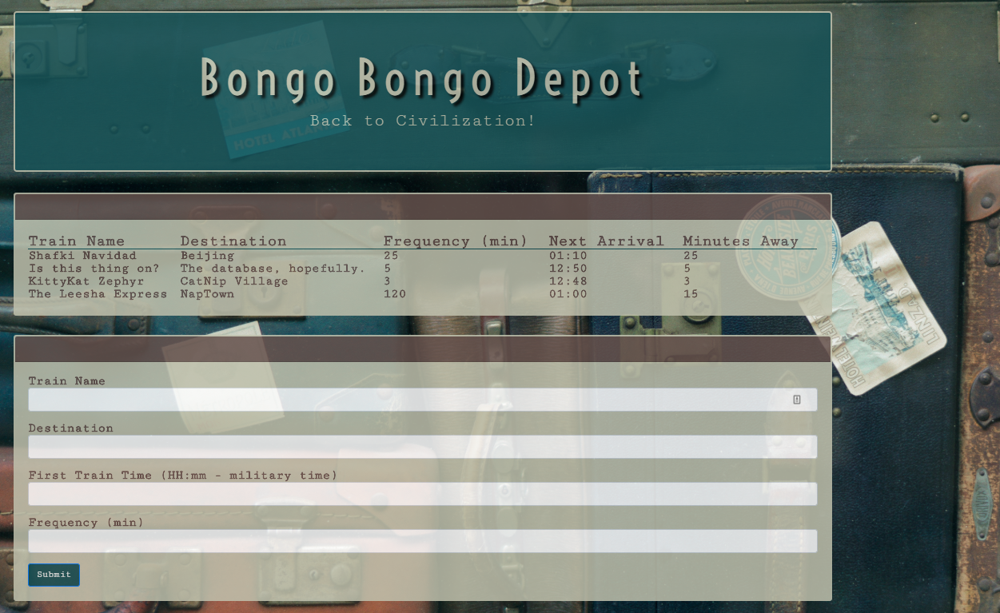

## Bongo Bongo Depot
This application is a train schedule that incorporates Firebase to host arrival and departure data. This app retrieves and manipulates this information with Moment.js. This website will provide up-to-date information about various trains, namely their arrival times and how many minutes remain until they arrive at their station.

## Getting Started
Play here: https://alyciamriley.github.io/train-scheduler/

## Technologies Used
- Firebase
- Moment.js
- jQuery
- Bootstrap
- Google Fonts

## Screenshots

## Built With

- Brackets- Text Editor
- Bootstrap- Wireframe

## Future Development

- Add an option to clear old train schedule. 

## Authors

* Alycia Riley
* [www.code-retro.com](http://www.code-retro.com)

